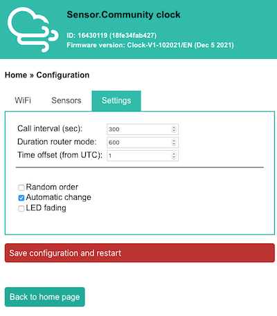

# SCClock
A NTP clock with PM display

## Features:
* NTP sync with the server of LNE-SYRTE in Paris
* Show the PM values of one or multiple sensors from the Sensor.Community API
* Configuration interface on the local network like Sensor.Community
* A few functions: automatic change, fading, random order 

## BOM:
* NodeMCU 0.9
* WS2812 8x8 LED Matrix
* TM1637 4 digit 7 segment
* push button

